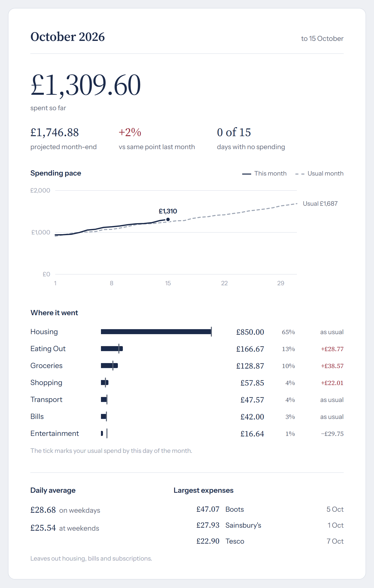

# Telegram Expense Tracker

A Telegram bot for keeping track of what you spend. You text it things like `15 lunch` and it files them away. When you ask for a report, it sends back a bank-statement style summary with a few concrete ideas for saving money, each with a pound figure attached.

I built it for myself and a few friends. It runs on a small server of mine, so the hosted version is invite-only, but you can run your own copy (see below).

<p align="center">
  
</p>

<sub>Sample report made from simulated data.</sub>

## What it does

**Logging takes a few words.** Type the amount and what it was, in either order. The bot guesses the category, and if it gets one wrong, it remembers your correction next time.

```
15 lunch
4.20 coffee pret
20 groceries yesterday
12 taxi 03/10
```

**Planning ahead.** Give a future date (`150 flights 31/12/26`) and it becomes a planned payment, with a reminder on the day. Repeating costs like rent or Spotify go in once with `/recurring 12 netflix monthly` and get logged automatically from then on.

**Reports.** `/report` covers this month, and `/report week`, `/report lastmonth` and `/report year` cover the rest. Each one comes as an image like the one above, plus a short message with saving tips, for example:

> Groceries is £38.57 above usual. Getting back to usual saves about £38.57 this month.

You also get a short summary every Sunday evening and a full report at the start of each month. `/notify off` turns those off.

**Your data stays yours.** `/export` sends everything you've logged as a CSV, and `/deleteaccount` wipes it all.

## How the numbers work

Most of the effort went into making the report honest, because a budgeting tool that cries wolf gets ignored.

- **Like-for-like comparisons.** "Usual" means what you normally spend by this day of the month, not a monthly average split evenly across 30 days. Otherwise rent paid on the 1st would make every month look like a disaster in its first week.
- **Projections that make sense.** Month-end estimate = what you've spent + what you usually spend in the rest of the month + anything already planned. One big purchase early on isn't stretched across the whole month as if you'll keep doing it every day.
- **Fixed costs kept out of habits.** Rent, bills and subscriptions still count towards your totals, but they're left out of daily averages and the "largest expenses" list, where they'd drown out everything you actually have a choice about.
- **Penny-exact money.** Every amount is rounded half-up to the penny each time it's stored, compared or shown, so totals always add up to what you see.

## Running your own copy

You'll need Python 3.12 and a bot token from [@BotFather](https://t.me/BotFather) on Telegram.

```bash
python -m venv .venv
source .venv/bin/activate        # on Windows: .venv\Scripts\activate
pip install -r requirements.txt
python -m playwright install chromium   # used to draw the report images
```

Create an env file **outside** the project folder, for example `~/expense-bot/bot.env`:

```
TEST_TELEGRAM_TOKEN=123456:your-token-from-botfather
DB_PATH=/home/you/expense-bot/expenses.db
BACKUP_DIR=/home/you/expense-bot/backups
INVITE_CODE=pick-any-code
```

Then start it:

```bash
EXPENSE_BOT_ENV=~/expense-bot/bot.env python -m expense_bot.main
```

New users join with the link `https://t.me/<your_bot>?start=<INVITE_CODE>`. Telegram only carries a code of 1 to 64 letters, digits, `_` or `-`, so the bot refuses to start with anything else.

Optionally add `OWNER_ID=<your Telegram user ID>`. The bot then messages you whenever someone new joins, and `/stats` (hidden from the menu, answered only for you) shows how many users there are and how many are active. Anyone who finds the bot without it gets a polite "invite-only" reply, and nothing is stored about them.

If you keep a separate bot for production, put its token in `LIVE_TELEGRAM_TOKEN` and set `EXPENSE_BOT_MODE=live`. Without that, the bot always uses the test token, so a local run can't take over your real bot by accident. `deploy/expense-bot.service` is the systemd unit I use on my server.

## Under the hood

- Python, [python-telegram-bot](https://python-telegram-bot.org/) and SQLite. Report images are HTML pages screenshotted by headless Chromium through Playwright.
- The logic that parses entries and works out reports is plain Python with no Telegram or database code in it, so it's easy to test. The Telegram layer on top is kept thin.
- Every database query is filtered by user, and each person only ever sees their own entries.
- An hourly job handles recurring payments, reminders and summaries. Anything that fails to send is retried, and a problem with one user's data never holds up anyone else's messages.
- 177 tests: `python -m pytest -q`

## Licence

MIT, see [LICENSE](LICENSE). The bundled fonts, Source Serif 4 and Instrument Sans, are under the SIL Open Font License (`expense_bot/assets/fonts/LICENSE.txt`).
